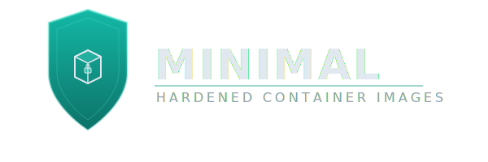

<p align="center">
  
</p>

<p align="center">
  Production-ready container images with <strong>minimal CVEs</strong>, rebuilt daily using
  <a href="https://github.com/chainguard-dev/apko">Chainguard's apko</a> and
  <a href="https://github.com/wolfi-dev">Wolfi</a> packages.
</p>

<p align="center">
  <a href="https://github.com/rtvkiz/minimal/actions/workflows/build.yml"></a>
  <a href="https://opensource.org/licenses/MIT"></a>
  
  
</p>

---

## Why This Matters

Container vulnerabilities are a top attack vector. Most base images ship with dozens of known CVEs that take weeks or months to patch:

> **Traditional images** — `debian:latest` — **127 CVEs**, patched in ~30 days
>
> **Minimal images** — `minimal-python` — **0-5 CVEs**, patched in <48 hours

**Impact:**
- **Compliance ready** — Pass SOC2, FedRAMP, and PCI-DSS security audits
- **Reduced attack surface** — Minimal, distroless images with only essential packages
- **Rapid CVE patching** — Fixes within 24-48 hours of disclosure (vs weeks for Debian/Ubuntu)
- **Supply chain security** — Cryptographically signed images with full SBOM

## Available Images

| Image | Pull Command | Shell | Use Case |
|-------|--------------|-------|----------|
| | | **Languages** | |
| **Python** | `docker pull ghcr.io/rtvkiz/minimal-python:latest` | No | Python apps, microservices |
| **Node.js-slim** | `docker pull ghcr.io/rtvkiz/minimal-node-slim:latest` | No | Node.js apps, JavaScript |
| **Bun** | `docker pull ghcr.io/rtvkiz/minimal-bun:latest` | No | Fast JavaScript/TypeScript runtime |
| **Go** | `docker pull ghcr.io/rtvkiz/minimal-go:latest` | No | Go development, CGO builds |
| **.NET Runtime** | `docker pull ghcr.io/rtvkiz/minimal-dotnet:latest` | No | .NET 10 runtime for apps |
| **Java** | `docker pull ghcr.io/rtvkiz/minimal-java:latest` | No | OpenJDK 21 JRE for Java apps |
| **PHP** | `docker pull ghcr.io/rtvkiz/minimal-php:latest` | No | PHP 8.5 CLI (built from source) |
| **Rails** | `docker pull ghcr.io/rtvkiz/minimal-rails:latest` | No | Ruby 4.0 + Rails 8.1 (built from source) |
| | | **Web Servers** | |
| **Nginx** | `docker pull ghcr.io/rtvkiz/minimal-nginx:latest` | No | Reverse proxy, static files |
| **HTTPD** | `docker pull ghcr.io/rtvkiz/minimal-httpd:latest` | Maybe* | Apache web server |
| | | **Databases** | |
| **MySQL** | `docker pull ghcr.io/rtvkiz/minimal-mysql:latest` | Yes | Relational database, LTS track (8.4.x), built from source |
| **PostgreSQL-slim** | `docker pull ghcr.io/rtvkiz/minimal-postgres-slim:latest` | No | Relational database |
| **SQLite** | `docker pull ghcr.io/rtvkiz/minimal-sqlite:latest` | No | Embedded SQL database CLI |
| | | **Caching** | |
| **Redis-slim** | `docker pull ghcr.io/rtvkiz/minimal-redis-slim:latest` | No | In-memory data store |
| **Memcached** | `docker pull ghcr.io/rtvkiz/minimal-memcached:latest` | No | In-memory caching (built from source) |
| | | **CI/CD** | |
| **Jenkins** | `docker pull ghcr.io/rtvkiz/minimal-jenkins:latest` | Yes | CI/CD automation |

*\*HTTPD, Jenkins may include shell(sh,busybox) via transitive Wolfi dependencies. MySQL includes busybox for its auto-init entrypoint script. CI treats shell presence as informational.*

## Quick Start

```bash
# Python - run your app
docker run --rm -v $(pwd):/app ghcr.io/rtvkiz/minimal-python:latest /app/main.py

# Node.js - run your app
docker run --rm -v $(pwd):/app -w /app ghcr.io/rtvkiz/minimal-node-slim:latest index.js

# Bun - fast JavaScript runtime
docker run --rm ghcr.io/rtvkiz/minimal-bun:latest --version

# Go - build your app
docker run --rm -v $(pwd):/app -w /app ghcr.io/rtvkiz/minimal-go:latest build -o /tmp/app .

# Nginx - reverse proxy
docker run -d -p 8080:80 ghcr.io/rtvkiz/minimal-nginx:latest

# HTTPD - serve static content
docker run -d -p 8080:80 ghcr.io/rtvkiz/minimal-httpd:latest

# Jenkins - CI/CD controller
docker run -d -p 8080:8080 -v jenkins_home:/var/jenkins_home ghcr.io/rtvkiz/minimal-jenkins:latest

# Redis - in-memory data store
docker run -d -p 6379:6379 ghcr.io/rtvkiz/minimal-redis-slim:latest

# MySQL - relational database (LTS)
docker run -d -p 3306:3306 -v mysqldata:/var/lib/mysql ghcr.io/rtvkiz/minimal-mysql:latest

# Memcached - in-memory caching
docker run -d -p 11211:11211 ghcr.io/rtvkiz/minimal-memcached:latest

# PostgreSQL - relational database
docker run -d -p 5432:5432 -v pgdata:/var/lib/postgresql/data ghcr.io/rtvkiz/minimal-postgres-slim:latest

# SQLite - embedded SQL database
docker run --rm -v $(pwd):/data ghcr.io/rtvkiz/minimal-sqlite:latest /data/mydb.sqlite "SELECT sqlite_version();"

# .NET - run your app
docker run --rm -v $(pwd):/app ghcr.io/rtvkiz/minimal-dotnet:latest /app/myapp.dll

# Java - run your app
docker run --rm -v $(pwd):/app ghcr.io/rtvkiz/minimal-java:latest -jar /app/myapp.jar

# PHP - run your app
docker run --rm -v $(pwd):/app ghcr.io/rtvkiz/minimal-php:latest /app/index.php

# Rails - run your app
docker run --rm -v $(pwd):/app ghcr.io/rtvkiz/minimal-rails:latest -e "require 'rails'; puts Rails.version"
```

## Security Features

| | | |
|:--|:--|:--|
| **Vulnerability scanning** — Every build scanned with Trivy; results in job summary and Security tab | **Immutable tags** — Chainguard-style `VERSION-rN` tags for reproducible deployments | **Signed images** — All images signed with [cosign](https://github.com/sigstore/cosign) keyless signing |
| **SBOM generation** — Full software bill of materials in SPDX format | **Non-root users** — All images run as non-root by default | **Minimal attack surface** — Only essential packages included |
| **Shell-less images** — Most images have no shell | **Reproducible builds** — Declarative apko configurations | **Multi-architecture** — Native support for AMD64 and ARM64 |

## Image Tags

Every image is published with two tags:

| Tag | Format | Example | Mutable |
|-----|--------|---------|---------|
| **Version** | `VERSION-rEPOCH` | `ghcr.io/rtvkiz/minimal-redis-slim:8.4.1-r0` | No (immutable) |
| **Latest** | `latest` | `ghcr.io/rtvkiz/minimal-redis-slim:latest` | Yes (floating) |

**For production, pin to the immutable version tag:**

```bash
# Immutable — guaranteed to never change
docker pull ghcr.io/rtvkiz/minimal-redis-slim:8.4.1-r0

# Floating — always points to the most recent build
docker pull ghcr.io/rtvkiz/minimal-redis-slim:latest
```

The `-r0` suffix is the revision number. It resets to `r0` on each new upstream version and increments (`r1`, `r2`, ...) for rebuilds of the same version (e.g., dependency patches, config changes). This follows the same convention as [Chainguard Images](https://www.chainguard.dev/chainguard-images).

Old version tags are preserved — upgrading to a new version does not remove previous tags from the registry.

## How Images Are Built

```
┌─────────────────────────────────────────────────────────────────────────────┐
│                            BUILD PIPELINE                                   │
├─────────────────────────────────────────────────────────────────────────────┤
│                                                                             │
│  Signing Keys:                                                              │
│  ┌─────────────────────────────────────────────────────────────────────┐    │
│  │  PRs: keygen job (ephemeral) │ Main: repository secrets (persistent)│    │
│  └─────────────────────────────────────────────────────────────────────┘    │
│                              │                                              │
│                              ▼                                              │
│  ┌─────────────────────────────┐    ┌─────────────────────────────────────┐ │
│  │     melange-build (8 jobs)  │    │      build-apko (9 jobs)            │ │
│  │     Native ARM64 runners    │    │      Wolfi pre-built packages       │ │
│  │  ┌────────┐  ┌────────────┐ │    │  Python, Node, Go, Nginx, HTTPD,    │ │
│  │  │ x86_64 │  │  aarch64   │ │    │  PostgreSQL, Bun, SQLite, .NET,     │ │
│  │  │ ubuntu │  │ ubuntu-arm │ │    │  Java                               │ │
│  │  └────┬───┘  └─────┬──────┘ │    │  ┌─────────┐     ┌───────────────┐  │ │
│  │       │            │        │    │  │  Wolfi  │────►│ apko publish  │  │ │
│  │       └─────┬──────┘        │    │  │ packages│     │ (multi-arch)  │  │ │
│  │             ▼               │    │  └─────────┘     └───────┬───────┘  │ │
│  │     ┌──────────────┐        │    │                          │          │ │
│  │     │   artifacts  │        │    └──────────────────────────│──────────┘ │
│  │     │ (x86+arm64)  │        │                               │            │
│  │     └──────┬───────┘        │                               │            │
│  └────────────│────────────────┘                               │            │
│               ▼                                                │            │
│  ┌─────────────────────────────┐                               │            │
│  │  build-melange (6 jobs)     │                               │            │
│  │  Jenkins, Redis, MySQL,     │                               │            │
│  │  Memcached, Caddy, HAProxy, │                               │            │
│  │  PHP, Rails                 │                               │            │
│  │  ┌─────────┐ ┌────────────┐ │                               │            │
│  │  │  merge  │►│   apko     │─┼───────────────────────────────┤            │
│  │  │ packages│ │  publish   │ │                               │            │
│  │  └─────────┘ └────────────┘ │                               │            │
│  └─────────────────────────────┘                               │            │
│                                                                ▼            │
│  ┌──────────────────────────────────────────────────────────────────────┐   │
│  │                        Verification & Publish                        │   │
│  │  ┌─────────────┐     ┌─────────────┐     ┌─────────────────────────┐ │   │
│  │  │   Trivy     │────►│    Test     │────►│  cosign sign + SBOM     │ │   │
│  │  │  CVE scan   │     │   image     │     │  (keyless signing)      │ │   │
│  │  └─────────────┘     └─────────────┘     └─────────────────────────┘ │   │
│  └──────────────────────────────────────────────────────────────────────┘   │
│                                                                             │
│  Note: PRs build and test but do not publish. Only main branch publishes.   │
│                                                                             │
└─────────────────────────────────────────────────────────────────────────────┘
```

### Update Schedule

| Trigger | When | Purpose |
|---------|------|---------|
| **Scheduled** | Daily at 2:00 AM UTC | Pick up latest CVE patches from Wolfi |
| **Push** | On merge to `main` | Deploy configuration changes |
| **Manual** | Workflow dispatch | Emergency rebuilds |

Every build is scanned for vulnerabilities; results appear in the job summary and Security tab. We rely on Wolfi's fast CVE patching—images may temporarily include known issues from upstream until fixes are available.

### Automated Version Updates

Source-built packages (Jenkins, Redis, MySQL, Memcached, PHP, Rails) and Wolfi-based packages are tracked by dedicated workflows that check for new releases daily and open PRs automatically:

| Workflow | Watches | What It Does |
|----------|---------|--------------|
| `update-jenkins.yml` | Jenkins LTS releases | Updates version in melange config, Makefile, build.yml |
| `update-redis.yml` | Redis GitHub releases | Updates version and SHA256 in melange config |
| `update-mysql.yml` | MySQL LTS (8.4.x) GitHub tags | Updates version and SHA256 in melange config |
| `update-memcached.yml` | Memcached GitHub releases | Updates version and SHA256 in melange config |
| `update-php.yml` | php.net releases API | Updates version and SHA256; opens issue for new minor/major series |
| `update-rails.yml` | RubyGems API + Ruby GitHub tags | Updates Rails gem and Ruby source versions independently |
| `update-wolfi-packages.yml` | Wolfi APKINDEX | Detects new Python, Node, Go, .NET, Java, PostgreSQL package versions |

Patch updates are auto-PR'd and validated by CI. Minor/major version bumps (e.g. PHP 8.5 → 8.6) create a GitHub Issue with a manual upgrade checklist, since configure flags or APIs may change.

<details>
<summary><strong>Image Specifications</strong></summary>

<br>

| Image | Version | User | Entrypoint | Workdir |
|-------|---------|------|------------|---------|
| Python | 3.14.x | nonroot (65532) | `/usr/bin/python3` | `/app` |
| Node.js-slim | 25.x | nonroot (65532) | `/usr/bin/dumb-init -- /usr/bin/node` | `/app` |
| Bun | latest | nonroot (65532) | `/usr/bin/bun` | `/app` |
| Go | 1.25.x | nonroot (65532) | `/usr/bin/go` | `/app` |
| Nginx | mainline | nginx (65532) | `/usr/sbin/nginx -g "daemon off;"` | `/` |
| HTTPD | 2.4.x | www-data (65532) | `/usr/sbin/httpd -DFOREGROUND` | `/var/www/localhost/htdocs` |
| Jenkins | 2.541.x LTS | jenkins (1000) | `tini -- java -jar jenkins.war` | `/var/jenkins_home` |
| Redis | 8.4.x | redis (65532) | `/usr/bin/redis-server` | `/` |
| MySQL | 8.4.x | mysql (65532) | `/usr/bin/docker-entrypoint.sh` | `/` |
| Memcached | 1.6.x | memcached (65532) | `/usr/bin/memcached` | `/` |
| PostgreSQL | 18.x | postgres (70) | `/usr/bin/postgres` | `/` |
| SQLite | 3.51.x | nonroot (65532) | `/usr/bin/sqlite3` | `/data` |
| .NET Runtime | 10.x | nonroot (65532) | `/usr/bin/dotnet` | `/app` |
| Java | 21.x | nonroot (65532) | `/usr/bin/java` | `/app` |
| PHP | 8.5.x | nonroot (65532) | `/usr/bin/php` | `/app` |
| Rails | Ruby 4.0.x + Rails 8.1.x | nonroot (65532) | `/usr/bin/ruby` | `/app` |

</details>

<details>
<summary><strong>Build Locally</strong></summary>

<br>

```bash
# Prerequisites
go install chainguard.dev/apko@latest
go install chainguard.dev/melange@latest  # needed for Jenkins, Redis, MySQL, Memcached, PHP, Rails
brew install trivy  # or: apt install trivy

# Build all images
make build

# Build specific image
make python
make node-slim
make bun
make go
make nginx
make httpd
make jenkins
make redis-slim
make mysql
make memcached
make postgres-slim
make sqlite
make dotnet
make java
make php
make rails

# Scan for CVEs
make scan

# Run tests
make test
```

</details>

<details>
<summary><strong>Project Structure</strong></summary>

<br>

```
minimal/
├── python/apko/python.yaml       # Python image (Wolfi pkg)
├── node-slim/apko/node.yaml      # Node.js slim image (Wolfi pkg, shell-less)
├── bun/apko/bun.yaml             # Bun image (Wolfi pkg)
├── go/apko/go.yaml               # Go image (Wolfi pkg)
├── nginx/apko/nginx.yaml         # Nginx image (Wolfi pkg)
├── httpd/apko/httpd.yaml         # HTTPD image (Wolfi pkg)
├── jenkins/
│   ├── apko/jenkins.yaml         # Jenkins image
│   └── melange.yaml              # jlink JRE build
├── redis-slim/
│   ├── apko/redis.yaml           # Redis image
│   └── melange.yaml              # Redis source build
├── mysql/
│   ├── apko/mysql.yaml           # MySQL LTS image
│   └── melange.yaml              # MySQL LTS source build
├── memcached/
│   ├── apko/memcached.yaml       # Memcached image
│   └── melange.yaml              # Memcached source build
├── postgres-slim/apko/postgres.yaml  # PostgreSQL image (Wolfi pkg)
├── sqlite/apko/sqlite.yaml          # SQLite image (Wolfi pkg)
├── dotnet/apko/dotnet.yaml          # .NET Runtime image (Wolfi pkg)
├── java/apko/java.yaml              # OpenJDK 21 JRE image (Wolfi pkg)
├── php/
│   ├── apko/php.yaml                # PHP image
│   └── melange.yaml                 # PHP from source (php.net)
├── rails/
│   ├── apko/rails.yaml              # Rails image
│   └── melange.yaml                 # Ruby from source + Rails gem
├── .github/workflows/
│   ├── build.yml                 # Daily CI pipeline
│   ├── update-jenkins.yml        # Jenkins version updates
│   ├── update-php.yml            # PHP version updates (from php.net)
│   ├── update-rails.yml          # Rails/Ruby version updates
│   ├── update-redis.yml          # Redis version updates
│   ├── update-mysql.yml          # MySQL LTS version updates
│   ├── update-memcached.yml      # Memcached version updates
│   └── update-wolfi-packages.yml # Wolfi package updates
├── Makefile
└── LICENSE
```

</details>

## Supported Architectures

All images are published as multi-architecture manifests supporting:

| Architecture | Platform | Status |
|--------------|----------|--------|
| `x86_64` | `linux/amd64` | Supported |
| `aarch64` | `linux/arm64` | Supported |

Docker and container runtimes automatically pull the correct architecture for your platform.

## Verify Image Signatures

All images are signed with [cosign](https://github.com/sigstore/cosign) keyless signing via Sigstore. To verify:

```bash
cosign verify \
  --certificate-oidc-issuer https://token.actions.githubusercontent.com \
  --certificate-identity-regexp https://github.com/rtvkiz/minimal/ \
  ghcr.io/rtvkiz/minimal-python:latest
```

Replace `minimal-python` with any image name. A successful output confirms the image was built by this repository's CI pipeline and hasn't been tampered with.

## License

This project is licensed under the **MIT License** - see the [LICENSE](LICENSE) file for details.

### Third-Party Packages

Container images include packages from [Wolfi](https://github.com/wolfi-dev) and other sources, each with their own licenses (Apache-2.0, MIT, GPL, LGPL, BSD, etc.). Full license information is included in each image's SBOM:

```bash
# View package licenses in an image
cosign download sbom ghcr.io/rtvkiz/minimal-python:latest | jq '.packages[].licenseConcluded'
```
